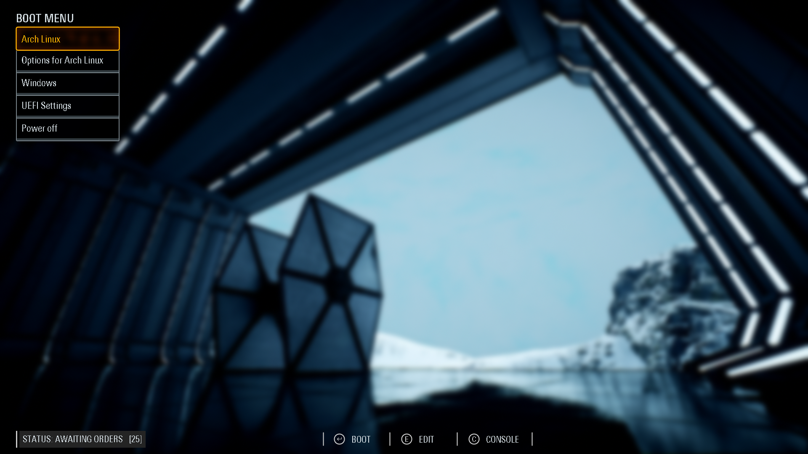
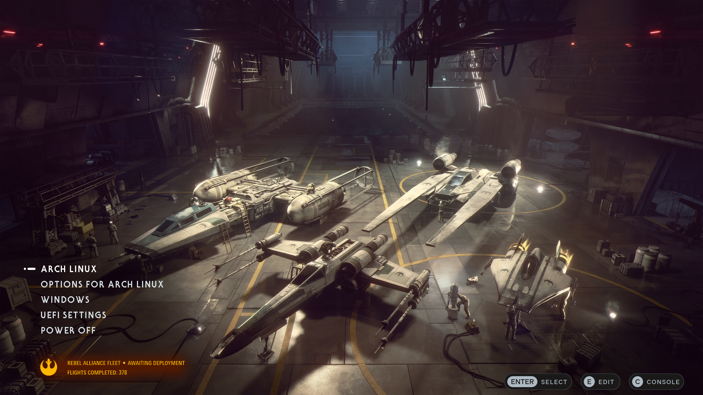

<p align="center">
  <b>&gt; GRUB themes &lt;</b> &nbsp;•&nbsp; <a href="https://github.com/SaharaSurfer/boot-wars-plymouth">Plymouth theme</a>
</p>

# Boot Wars: GRUB

A collection of Star Wars-inspired themes for the GRUB2 bootloader. These themes were designed for 1920x1080, so you may need to tweak things for other resolutions.

## Previews

|     |     |
|:---:|:---:|
|  |  |
| [Starkiller Hangar](https://wall.alphacoders.com/big.php?i=1020585) | [Rebel Hangar](https://www.starwars.com/star-wars-squadrons-screenshots?image_id=5ed004dc9a4b370057b166d2) |

## Installation

1.  Clone the repository:
    ```bash
    git clone https://github.com/SaharaSurfer/boot-wars-grub.git
    cd boot-wars-grub
    ```
2.  Copy the theme directory to `/boot/grub/themes/`:
    ```bash
    sudo cp -r rebel_hangar/theme /boot/grub/themes/rebel_hangar
    ```
3.  Edit your GRUB configuration:
    ```bash
    sudo nano /etc/default/grub
    ```
    Add or modify the following line:
    ```ini
    GRUB_THEME="/boot/grub/themes/rebel_hangar/theme.txt"
    ```
4.  Update GRUB:
    ```bash
    # Arch Linux
    sudo grub-mkconfig -o /boot/grub/grub.cfg
    ```

## Notes

All themes are considered **WIP** and may change over time, depending on bursts of motivation and imagination. Some themes include `.sh` scripts left from the creation process, and you are welcome to use them to tweak various elements.

## Credits 

All background artwork and screenshot sources are credited via links in the [Previews](#previews) table.

>**Disclaimer:** This project is a fan work inspired by Star Wars. Star Wars, its logos, and characters are trademarks of Disney/Lucasfilm Ltd. This project is not affiliated with or endorsed by Disney, EA, or DICE. All generated assets are for personal customization use only.
